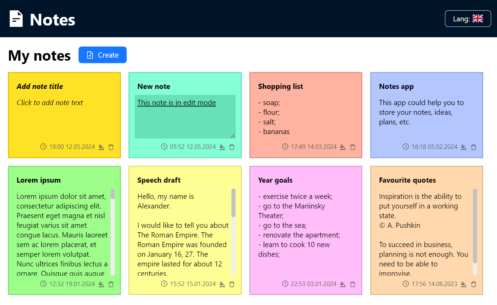
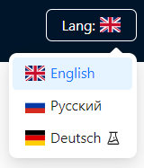

# Notes
Multilingual react app with notes stored locally in your browser

> #### Project goals
> Creating this project author want to practice creating multilingual applications and train [MobX](https://mobx.js.org/) library

## View deploy
The project is hosted on github-pages, so you can open it using the link: https://pashabezk.github.io/Notes/

## How to run locally

1. To run the project, you must first install [Node.js](https://nodejs.org/en/).
2. To run locally, you need to download the project archive or clone your repository `git clone https://github.com/pashabezk/Notes`.
3. Next, you need to go to the root folder of the project `cd Notes`.
4. Before the first launch, you must install all dependencies using the command `npm install`.
5. To start the project, use the command `npm start`.
> Launching a project could take a long time
6. After launching, a browser window with the project will open. If this does not happen automatically, open the address [http://localhost:3000](http://localhost:3000).

## Project Features

* the project was written using the [React](https://ru.reactjs.org/) library and the [Typescript](https://www.typescriptlang.org/) language;
* the [MobX](https://mobx.js.org/) library was used as state management;
* with the [React Intl](https://formatjs.io/docs/getting-started/installation/) library, the application is available in Russian, English and German;
* the application automatically selects the page language based on available locales;
* the UI components used were taken from the [Ant Design](https://ant.design/) library;
* the application has an adaptive design for comfortable use on both large-screen devices and mobile devices;
* the application stores all data on the user's device using [local storage](https://developer.mozilla.org/en-US/docs/Web/API/Window/localStorage)

## App screenshots

On the picture below you could see application interface.

App try to autodetect user locale. Also, it is possible to change language using lang button in header.

Now app translated on:
* english,
* russian,
* deutsch (experimental)

